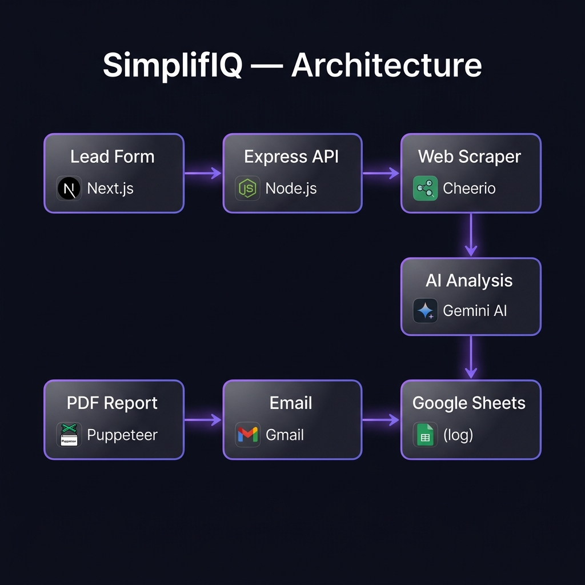
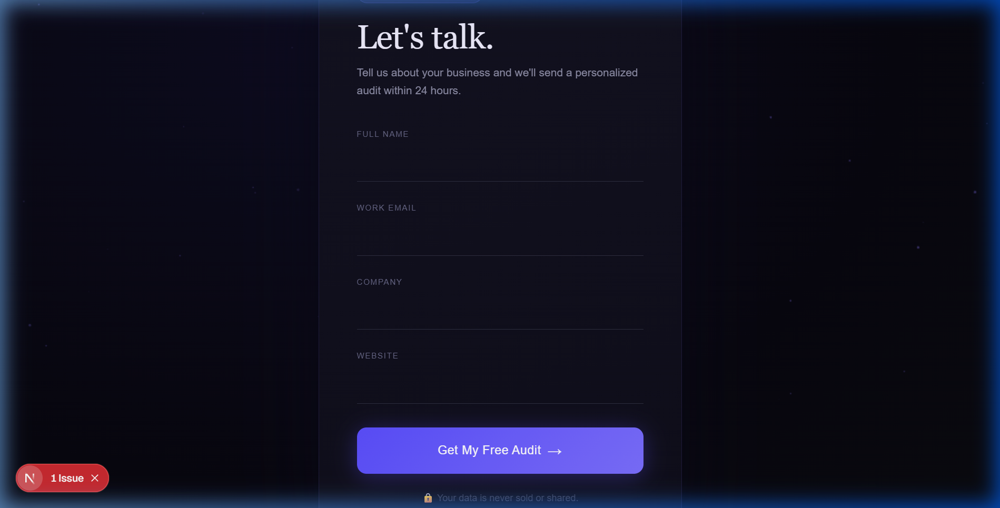

<p align="center">
  
</p>

<h1 align="center">🚀 SimplifIQ — AI-Powered Lead Automation</h1>

<p align="center">
  <strong>Turn every website visitor into a qualified lead with AI-generated business audits, delivered automatically.</strong>
</p>

<p align="center">
  
  
  
  
  
</p>

---

## 📋 Table of Contents

- [Overview](#-overview)
- [Screenshots](#-screenshots)
- [Architecture](#-architecture)
- [Tech Stack](#-tech-stack)
- [Project Structure](#-project-structure)
- [Getting Started](#-getting-started)
  - [Prerequisites](#prerequisites)
  - [Installation](#1-clone-the-repository)
  - [Environment Variables](#3-configure-environment-variables)
- [API Reference](#-api-reference)
- [Pipeline Deep Dive](#-pipeline-deep-dive)
- [Deployment](#-deployment)
- [Contributing](#-contributing)
- [License](#-license)

---

## 🎯 Overview

**SimplifIQ** is a full-stack AI lead automation system that captures a prospect's details, scrapes their website, generates a comprehensive business audit using **Google Gemini AI**, converts it into a beautifully designed **PDF report**, emails it directly to the lead, and logs everything to **Google Sheets** — all in one seamless pipeline triggered by a single form submission.

### What it does (end-to-end):

```
Lead submits form → Website scraped → AI analyzes business →
PDF report generated → Email sent with attachment → Lead logged to Google Sheets
```

### Key Features

| Feature | Description |
|---------|-------------|
| 🌐 **Intelligent Web Scraping** | Extracts title, meta tags, headings, paragraphs, tech stack, social links, and contact info |
| 🤖 **AI Business Audit** | Gemini 2.0 Flash generates a 7-section personalized growth report |
| 📄 **Premium PDF Reports** | Puppeteer renders a beautifully styled A4 report with hero section, cards, and branding |
| 📧 **Automated Emails** | Nodemailer sends personalized emails with the PDF attached via Gmail SMTP |
| 📊 **Google Sheets Logging** | Every lead is automatically logged with timestamp and delivery status |
| ✅ **Client & Server Validation** | Dual-layer validation prevents bad data at both frontend and API level |
| 🎨 **Premium UI** | Dark glassmorphism design with particle canvas, animations, and loading states |

---

## 📸 Screenshots

### Lead Capture Form

<p align="center">
  
</p>

> Premium dark-themed form with animated particle background, floating labels, gradient underlines, and real-time validation. Built with Next.js 16 + TypeScript.

---

## 🏗 Architecture

The system follows a **linear pipeline architecture** where each step feeds into the next:

```mermaid
graph LR
    A["🧑 Lead Form<br/>(Next.js)"] -->|POST /api/lead| B["⚙️ Express API<br/>(Node.js)"]
    B --> C["🔍 Web Scraper<br/>(Cheerio + Axios)"]
    C --> D["🤖 AI Analysis<br/>(Gemini 2.0 Flash)"]
    D --> E["📄 PDF Generator<br/>(Puppeteer)"]
    E --> F["📧 Email Service<br/>(Nodemailer + Gmail)"]
    F --> G["📊 Google Sheets<br/>(Logging)"]

    style A fill:#1e1b4b,stroke:#7c6fff,color:#fff
    style B fill:#1e1b4b,stroke:#7c6fff,color:#fff
    style C fill:#1e1b4b,stroke:#7c6fff,color:#fff
    style D fill:#1e1b4b,stroke:#7c6fff,color:#fff
    style E fill:#1e1b4b,stroke:#7c6fff,color:#fff
    style F fill:#1e1b4b,stroke:#7c6fff,color:#fff
    style G fill:#1e1b4b,stroke:#7c6fff,color:#fff
```



### Pipeline Steps

| Step | Service | File | What Happens |
|------|---------|------|--------------|
| 1 | **Validate** | `server.js` | Payload validated (name, email, company, website) |
| 2 | **Scrape** | `scrapeWebsite.js` | Website crawled for metadata, headings, content, tech stack, social links |
| 3 | **Analyze** | `generateInsights.js` | Gemini AI generates a 7-section business audit report |
| 4 | **PDF** | `generatePdf.js` | Puppeteer renders a premium HTML template into an A4 PDF |
| 5 | **Email** | `sendEmail.js` | Nodemailer sends personalized email with PDF attachment |
| 6 | **Log** | `logToSheets.js` | Lead data + status logged to Google Sheets |

---

## 🛠 Tech Stack

### Backend

| Technology | Purpose |
|------------|---------|
| **Node.js** + **Express 5** | REST API server |
| **Cheerio** + **Axios** | HTML parsing and HTTP requests for web scraping |
| **Google Generative AI** (`@google/generative-ai`) | Gemini 2.0 Flash for AI insights |
| **Puppeteer** | Headless Chrome for PDF generation |
| **Nodemailer** | SMTP email delivery via Gmail |
| **Google APIs** (`googleapis`) | Google Sheets integration |
| **dotenv** | Environment variable management |

### Frontend

| Technology | Purpose |
|------------|---------|
| **Next.js 16** (Turbopack) | React framework with server components |
| **TypeScript** | Type-safe development |
| **Tailwind CSS 4** | Utility-first styling |
| **Canvas API** | Animated particle background |

---

## 📁 Project Structure

```
SimplifIQ/
├── backend/
│   ├── services/
│   │   ├── scrapeWebsite.js      # Web scraping with tech stack detection
│   │   ├── generateInsights.js   # Gemini AI business analysis
│   │   ├── generatePdf.js        # Puppeteer PDF report generation
│   │   ├── sendEmail.js          # Gmail email with PDF attachment
│   │   └── logToSheets.js        # Google Sheets lead logging
│   ├── reports/                  # Generated PDF reports (auto-created)
│   ├── server.js                 # Express API with validation & pipeline
│   ├── package.json
│   ├── .env                      # Environment variables (not committed)
│   └── google-service-account.json  # Google Sheets credentials (not committed)
│
├── frontend/
│   ├── src/
│   │   └── app/
│   │       ├── page.tsx          # Main lead capture form
│   │       ├── layout.tsx        # Root layout
│   │       └── globals.css       # Global styles
│   ├── package.json
│   └── .env.local                # Frontend environment variables
│
├── screenshots/                  # README screenshots
├── render.yaml                   # Render deployment config
└── README.md
```

---

## 🚀 Getting Started

### Prerequisites

Before you begin, make sure you have the following installed:

| Requirement | Version | Check |
|-------------|---------|-------|
| **Node.js** | v18 or higher | `node -v` |
| **npm** | v9 or higher | `npm -v` |
| **Git** | Any recent version | `git --version` |
| **Google Chrome** | Required by Puppeteer | Installed on system |

You'll also need:
- A **Google Gemini API key** → [Get one here](https://aistudio.google.com/apikey)
- A **Gmail account** with App Password → [Create App Password](https://myaccount.google.com/apppasswords)
- A **Google Cloud Service Account** (for Sheets logging) → [Console](https://console.cloud.google.com/iam-admin/serviceaccounts)

---

### 1. Clone the Repository

```bash
git clone https://github.com/hemant2807/SimplifIQ-AI-Lead-Automation.git
cd SimplifIQ-AI-Lead-Automation
```

### 2. Install Dependencies

#### Backend

```bash
cd backend
npm install
```

#### Frontend

```bash
cd frontend
npm install
```

### 3. Configure Environment Variables

#### Backend — `backend/.env`

Create a `.env` file in the `backend/` directory:

```env
# Google Gemini AI
GEMINI_API_KEY=your_gemini_api_key_here

# Gmail SMTP (use App Password, NOT your regular password)
EMAIL_USER=your_email@gmail.com
EMAIL_PASS=your_gmail_app_password

# Server
PORT=5000
NODE_ENV=development
```

#### Frontend — `frontend/.env.local`

Create a `.env.local` file in the `frontend/` directory:

```env
NEXT_PUBLIC_API_URL=http://localhost:5000
```

### 4. Set Up Google Sheets Logging (Optional)

<details>
<summary><strong>Click to expand — Google Sheets setup guide</strong></summary>

1. **Create a Google Cloud Project** at [console.cloud.google.com](https://console.cloud.google.com)

2. **Enable the Google Sheets API**:
   - Go to _APIs & Services → Library_
   - Search for "Google Sheets API" and enable it

3. **Create a Service Account**:
   - Go to _IAM & Admin → Service Accounts_
   - Click **Create Service Account**
   - Give it a name (e.g., `simplifiq-sheets`)
   - Grant **Editor** role
   - Create a JSON key and download it

4. **Save the key file**:
   ```bash
   # Place the downloaded JSON file in backend/
   mv ~/Downloads/your-key-file.json backend/google-service-account.json
   ```

5. **Create a Google Sheet**:
   - Create a new sheet in Google Sheets
   - Copy the spreadsheet ID from the URL:
     ```
     https://docs.google.com/spreadsheets/d/SPREADSHEET_ID_HERE/edit
     ```
   - Share the sheet with the service account email (found in the JSON file)
   - Update the `spreadsheetId` in `backend/services/logToSheets.js`

6. **Add column headers** in Row 1:
   | A | B | C | D | E | F |
   |---|---|---|---|---|---|
   | Name | Email | Company | Website | Timestamp | Status |

</details>

### 5. Set Up Gmail App Password

<details>
<summary><strong>Click to expand — Gmail SMTP setup guide</strong></summary>

1. Go to [myaccount.google.com/security](https://myaccount.google.com/security)
2. Enable **2-Step Verification** if not already enabled
3. Go to [myaccount.google.com/apppasswords](https://myaccount.google.com/apppasswords)
4. Select **Mail** as the app
5. Click **Generate** — you'll get a 16-character password
6. Use this password as `EMAIL_PASS` in your `.env` file

> ⚠️ **Do NOT use your regular Gmail password.** App Passwords are separate credentials designed for third-party apps.

</details>

### 6. Run the Application

Open **two terminal windows**:

#### Terminal 1 — Backend

```bash
cd backend
npm run dev
```

Expected output:
```
[nodemon] starting `node server.js`
✅ Server running on port 5000 [development]
```

#### Terminal 2 — Frontend

```bash
cd frontend
npm run dev
```

Expected output:
```
▲ Next.js 16.2.6 (Turbopack)
- Local: http://localhost:3000
✓ Ready in 800ms
```

### 7. Test the Application

1. Open **http://localhost:3000** in your browser
2. Fill in the form with a real company website
3. Click **"Get My Free Audit"**
4. Check the backend terminal — you'll see the full pipeline executing:

```
[Lead] Processing: Acme Corp <jane@company.com>
[Scrape] Success: Acme Corp — Digital Solutions
[Insights] Generated (2847 chars)
[PDF] Generated: /reports/Acme_Corp_audit_report.pdf
[Email] Status: true
[Sheets] Lead logged successfully
```

---

## 📡 API Reference

### `GET /`

Health check endpoint.

```json
{
  "status": "ok",
  "service": "AI Audit API",
  "version": "1.0.0"
}
```

### `GET /health`

Detailed health status.

```json
{
  "status": "healthy",
  "timestamp": "2026-05-18T18:00:00.000Z"
}
```

### `POST /api/lead`

Main lead processing endpoint. Triggers the full pipeline.

**Request Body:**

```json
{
  "name": "Jane Smith",
  "email": "jane@company.com",
  "company": "Acme Corp",
  "website": "https://acme.com"
}
```

**Success Response (200):**

```json
{
  "success": true,
  "message": "Audit report generated successfully",
  "lead": {
    "name": "Jane Smith",
    "email": "jane@company.com",
    "company": "Acme Corp"
  },
  "scrapeSuccess": true,
  "pdfGenerated": true,
  "emailSent": true
}
```

**Validation Error (400):**

```json
{
  "success": false,
  "message": "Invalid request data",
  "details": ["email is not a valid address"]
}
```

---

## 🔬 Pipeline Deep Dive

### Step 1 — Web Scraping (`scrapeWebsite.js`)

The scraper goes beyond basic `<title>` extraction. It captures:

| Data Point | How It's Extracted |
|------------|-------------------|
| **Title & Meta** | `<title>`, `<meta name="description">`, OpenGraph tags |
| **Headings** | All `<h1>`, `<h2>`, `<h3>` tags (deduped, cleaned) |
| **Paragraphs** | Text content from `<p>`, `<li>`, `<span>`, `<div>` (40–800 chars, boilerplate filtered) |
| **Tech Stack** | Detected from `<script src>` tags — WordPress, Shopify, Webflow, HubSpot, Stripe, etc. |
| **Social Links** | Twitter, LinkedIn, Facebook, Instagram, YouTube, GitHub, TikTok |
| **Contact Info** | Email and phone regex extraction, contact page detection |

Includes a fallback mechanism — if scraping fails, a structured fallback object is returned so the pipeline continues.

### Step 2 — AI Analysis (`generateInsights.js`)

Uses **Gemini 2.0 Flash** with a highly engineered prompt that generates 7 sections:

1. **Company Overview** — What the company does, target market, value prop
2. **Website & Digital Presence Assessment** — SEO, UX, trust signals
3. **Key Business Strengths** — Competitive advantages
4. **Growth Opportunities** — Specific untapped levers
5. **AI & Automation Opportunities** — Concrete automation wins with tool recommendations
6. **Strategic Recommendations** — 90-day prioritized action items
7. **Audit Summary** — Sharp synthesis paragraph

### Step 3 — PDF Generation (`generatePdf.js`)

Puppeteer renders a custom HTML template into a pixel-perfect A4 PDF featuring:

- **Hero section** with gradient background and lead metadata
- **Overview cards** with company details
- **AI Analysis card** with formatted markdown-to-HTML conversion
- **Score pills** showing completion status
- **Branded footer** with generation date

### Step 4 — Email Delivery (`sendEmail.js`)

Sends a professional HTML email via Gmail SMTP with the PDF report attached. The email includes:
- Personalized greeting
- Company name reference
- PDF attachment named `{company}_report.pdf`

### Step 5 — Google Sheets Logging (`logToSheets.js`)

Logs each lead to a Google Sheet with:
- Name, Email, Company, Website
- Timestamp
- Delivery status (Sent/Failed)

---

## 🌍 Deployment

### Backend → Render

The project includes a `render.yaml` for one-click deployment:

```yaml
services:
  - type: web
    name: simplifiq-backend
    env: node
    rootDir: backend
    buildCommand: npm install
    startCommand: node server.js
```

**Steps:**
1. Push to GitHub
2. Connect repo to [Render](https://render.com)
3. Add environment variables in Render dashboard
4. Deploy

### Frontend → Vercel

1. Push to GitHub
2. Import project in [Vercel](https://vercel.com)
3. Set root directory to `frontend`
4. Add environment variable:
   ```
   NEXT_PUBLIC_API_URL=https://your-backend.onrender.com
   ```
5. Deploy

---

## 🤝 Contributing

Contributions are welcome! Here's how:

1. **Fork** the repository
2. **Create** a feature branch: `git checkout -b feature/amazing-feature`
3. **Commit** your changes: `git commit -m "Add amazing feature"`
4. **Push** to the branch: `git push origin feature/amazing-feature`
5. **Open** a Pull Request

---

## 📄 License

This project is licensed under the **ISC License**. See the [LICENSE](LICENSE) file for details.

---

<p align="center">
  <strong>Built with ❤️ by <a href="https://github.com/hemant2807">Hemant Kumar</a></strong>
</p>

<p align="center">
  <em>If you found this useful, give it a ⭐ on GitHub!</em>
</p>
